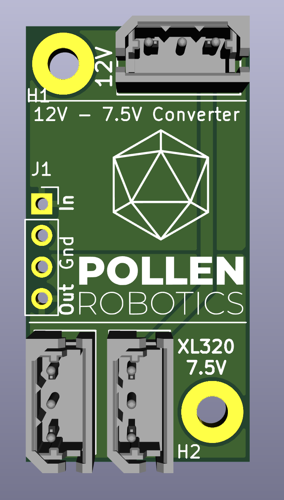

# 7V_converter
This repository contains the KiCad project of the board used to convert the 12V power of the Reachy robot to 7.5V to power the motors of the head.

## Additional Components

This PCB can't work alone, it needs a few Components soldered on it:
- D24V25F7 converter
- 1x 22-03-5035 connectors at the top to connect a DXL module
- 2x 532530370 connectors at the bottom to connect 2x XL-320 motors
